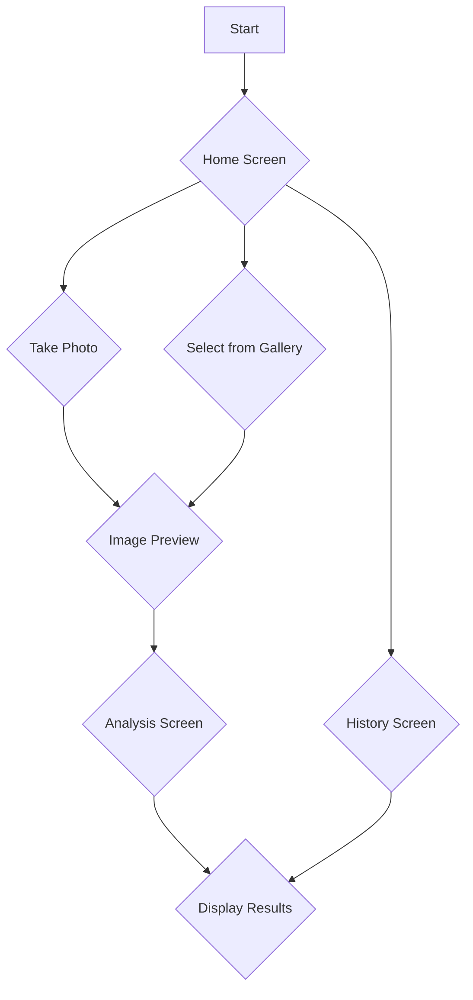
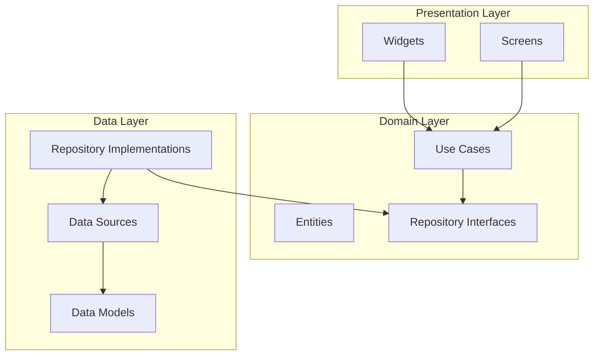

# NutriAI Design Document

## Overview

NutriAI is a Flutter application that allows users to take a picture of food, or select one from their gallery, and receive a nutritional analysis of the food in the image. The analysis will be performed by the Gemini API and the results will be displayed in a user-friendly format, including charts and graphs. The app will also store a history of past analyses for the user to review.

## Detailed Analysis of the Goal or Problem

The primary goal of NutriAI is to provide users with a quick and easy way to understand the nutritional content of their food. Many people are conscious of their diet and want to track their intake of calories, protein, fats, and other nutrients. However, manually looking up nutritional information can be tedious and time-consuming.

NutriAI solves this problem by leveraging the power of AI to analyze food images. Users can simply snap a photo of their meal, and the app will provide a detailed breakdown of its nutritional content. This empowers users to make more informed decisions about their diet and health.

### Key Features

*   **Image-based food analysis:** Users can either take a new photo or select an existing one from their gallery.
*   **AI-powered analysis:** The Gemini API will be used to analyze the food image and identify the ingredients and their nutritional values.
*   **Rich UI for results:** The nutritional information will be displayed in a clear and visually appealing way, using formatted lists, charts, and graphs.
*   **History of analyses:** The app will store a history of all past food analyses, allowing users to track their dietary habits over time.
*   **Local storage:** The history will be stored locally on the device, so no user account is required.

## Alternatives Considered

### Architecture

*   **Feature-based architecture:** This is the chosen approach. It organizes the code by feature, which improves scalability and maintainability. Each feature will have its own presentation, domain, and data layers.
*   **Layer-based architecture:** This approach organizes the code by layer (e.g., UI, business logic, data). While simpler for small projects, it can become difficult to manage as the application grows.

### State Management

*   **ChangeNotifier with Provider:** This is a popular and relatively simple approach to state management in Flutter. However, for this project, we will use a combination of `ValueNotifier` for local state and `ChangeNotifier` for more complex, shared state, without introducing a dependency on the `provider` package, as per the project guidelines.
*   **Bloc/Cubit:** This is a more structured and powerful state management solution, but it has a steeper learning curve and can be overkill for an app of this size.
*   **Riverpod:** A newer state management library that is gaining popularity. It offers a number of advantages over Provider, but to keep things simple, we will stick with Flutter's built-in state management solutions.

### Local Storage

*   **shared_preferences:** This is a simple key-value store that is suitable for storing small amounts of data, such as user settings. However, it is not well-suited for storing structured data like a history of food analyses.
*   **Hive:** A lightweight and fast NoSQL database for Flutter. It is a good choice for storing structured data and is easier to use than SQLite. This will be the chosen solution for storing the analysis history.
*   **sqflite:** A Flutter plugin for SQLite. It is a powerful and flexible database, but it requires writing SQL queries and can be more complex to set up and use than Hive.

## Detailed Design

### Architecture

We will use a feature-based architecture with a clear separation of concerns. The app will be divided into the following layers:

*   **Presentation Layer:** This layer will contain all the UI-related code, including widgets and screens. It will be responsible for displaying data to the user and handling user input.
*   **Domain Layer:** This layer will contain the core business logic of the application. It will include use cases (e.g., `AnalyzeFoodImageUseCase`), entities (e.g., `FoodAnalysis`), and repository interfaces (e.g., `FoodAnalysisRepository`).
*   **Data Layer:** This layer will be responsible for retrieving and storing data. It will include repository implementations, data sources (e.g., `GeminiApi`, `LocalStorage`), and data models.

The project will be structured as follows:

```
nutri_ai/
├── lib/
│   ├── src/
│   │   ├── core/
│   │   │   ├── usecases/
│   │   │   ├── errors/
│   │   │   └── utils/
│   │   ├── features/
│   │   │   ├── analysis/
│   │   │   │   ├── data/
│   │   │   │   │   ├── datasources/
│   │   │   │   │   ├── models/
│   │   │   │   │   └── repositories/
│   │   │   │   ├── domain/
│   │   │   │   │   ├── entities/
│   │   │   │   │   ├── repositories/
│   │   │   │   │   └── usecases/
│   │   │   │   └── presentation/
│   │   │   │       ├── pages/
│   │   │   │       ├── widgets/
│   │   │   │       └── notifiers/
│   │   │   └── history/
│   │   │       ├── data/
│   │   │       │   ├── datasources/
│   │   │       │   ├── models/
│   │   │       │   └── repositories/
│   │   │       ├── domain/
│   │   │       │   ├── entities/
│   │   │       │   ├── repositories/
│   │   │       │   └── usecases/
│   │   │       └── presentation/
│   │   │           ├── pages/
│   │   │           ├── widgets/
│   │   │           └── notifiers/
│   │   ├── main.dart
│   │   └── injection_container.dart
│   └── ...
└── ...
```

### UI/UX

The app will have a simple and intuitive UI. The main screen will have a button to take a photo or select one from the gallery. Once an image is selected, it will be displayed on the screen, and the analysis will be performed. The results will be displayed on a new screen, with a formatted list of nutrients and charts to visualize the data.

The history screen will display a list of past analyses, with a thumbnail of the image and the date of the analysis. Tapping on an item in the history will take the user to the detailed results screen for that analysis.

### Data Management

*   **State Management:** We will use `ValueNotifier` for managing local UI state (e.g., loading indicators) and `ChangeNotifier` for managing the state of the analysis results and the history.
*   **Local Storage:** We will use the `hive` package to store the history of food analyses. Each analysis will be stored as a `FoodAnalysis` object, which will include the image path, the analysis results in JSON format, and the date of the analysis.

### Diagrams

#### App Flow



#### Architecture



## Summary of the Design

The NutriAI app will be a Flutter application that uses the Gemini API to analyze food images and provide nutritional information. It will have a feature-based architecture with a clear separation of concerns between the presentation, domain, and data layers. State management will be handled using Flutter's built-in `ValueNotifier` and `ChangeNotifier`, and local storage will be implemented using the `hive` package. The UI will be simple and intuitive, with a focus on providing a clear and visually appealing presentation of the analysis results.

## References

*   **Flutter App Architecture:** [https://flutter.dev/docs/development/data-and-backend/state-mgmt/options](https://flutter.dev/docs/development/data-and-backend/state-mgmt/options)
*   **Flutter State Management:** [https://docs.flutter.dev/data-and-backend/state-mgmt/simple](https://docs.flutter.dev/data-and-backend/state-mgmt/simple)
*   **Flutter Local Storage:** [https://docs.flutter.dev/cookbook/persistence/key-value](https://docs.flutter.dev/cookbook/persistence/key-value)
*   **Gemini API:** [https://ai.google.dev/docs](https://ai.google.dev/docs)
*   **Hive Package:** [https://pub.dev/packages/hive](https://pub.dev/packages/hive)
*   **Image Picker Package:** [https://pub.dev/packages/image_picker](https://pub.dev/packages/image_picker)
*   **Charts Flutter Package:** [https://pub.dev/packages/charts_flutter](https://pub.dev/packages/charts_flutter)

